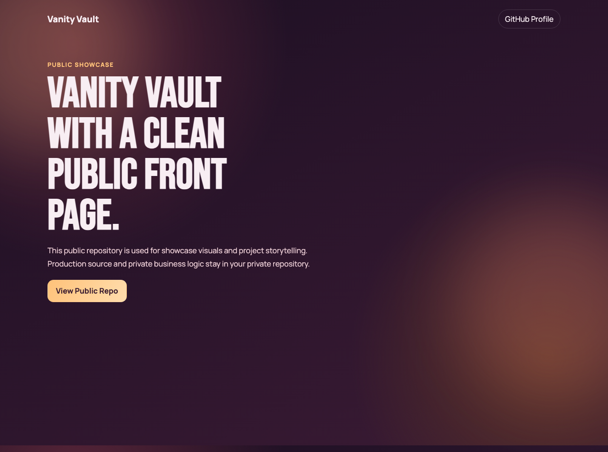
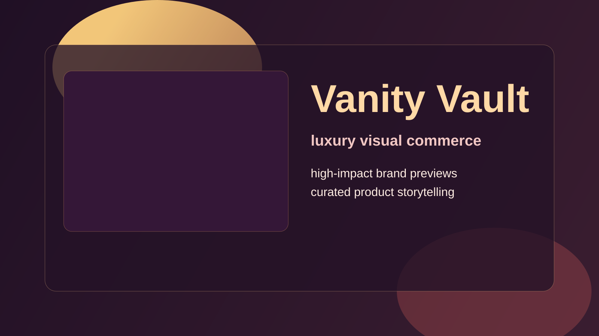

# Vanity Vault - Public Showcase

This is the public-facing showcase repository for Vanity Vault.

I keep this repo visual and portfolio-friendly so I can share project direction publicly, while production implementation and sensitive source code remain private.

## What is in this repo

- Animated front page for project presentation
- Branded preview assets
- Screenshot-based showcase section
- Lightweight setup (open index.html directly)

## Preview

## Why this format

The public repo is meant for:

- client demos
- recruiter portfolio review
- social/profile project highlights

without exposing private business logic.

## Run locally

1. Clone the repo
2. Open index.html in your browser

## Inspiration

- https://github.com/MoncyDev/Portfolio-Website
